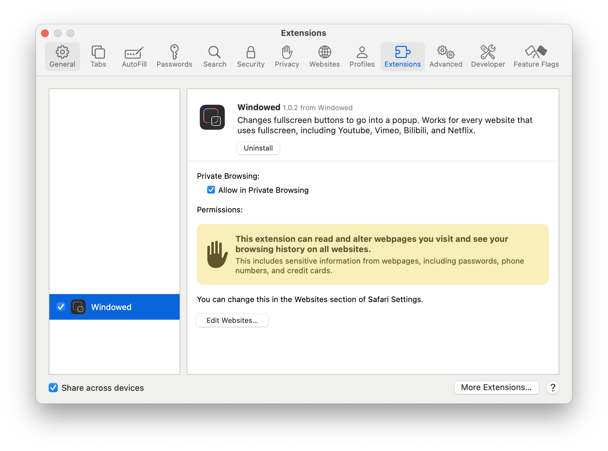
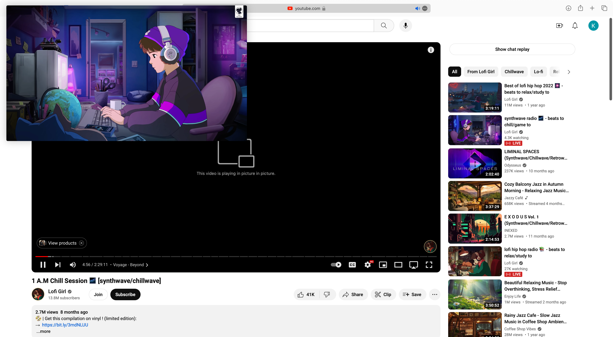

## Windowed for Safari

The [Windowed extension](https://github.com/dralletje/Windowed) for [Apple Safari](https://www.apple.com/safari/).
It has the same functionality as the [Chrome extension](https://chromewebstore.google.com/detail/windowed-floating-youtube/gibipneadnbflmkebnmcbgjdkngkbklb).

## Installation

- Download the file `Windowed.app.zip` from [latest release](./releases).
- Unzip the file and drag it to your `Applications` folder.
- **In the Applications folder, right-click** the `Windowed.app` and select `Open`. Then it will pop up the app like this:

  
   

- After that, you can open the app normally.

  
   

## New UI

### Toolbar Button

  
   

### Pop-up 

  
   

### In-Window Mode

  
   

### Picture-in-Picture Mode

  
   

## Development

- Clone the repo
- Run `bash convert.sh` to convert the original Chrome extension to Safari extension (the converted extension will be in the `windowed-safari-app` folder)

> [!NOTE]
> The released extension is signed with my own Apple Developer ID without any verification from Apple Developer Program. So it won't show up in the Apple Extension Gallery - Apple Store. It would be great if someone can help me to sign the extension with a verified Apple Developer ID to distribute it in the Apple Store. Please contact me if you are willing to help.

## Credits

- [Windowed](https://github.com/dralletje/Windowed)