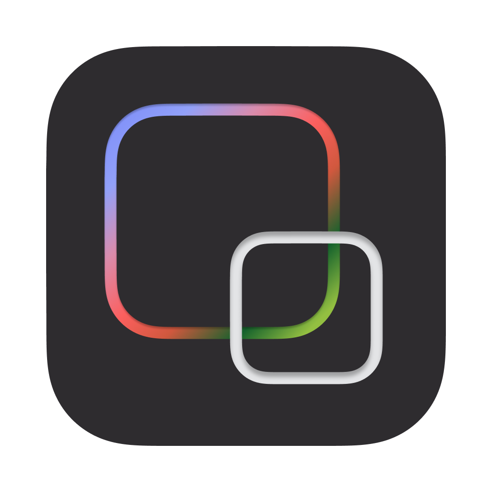
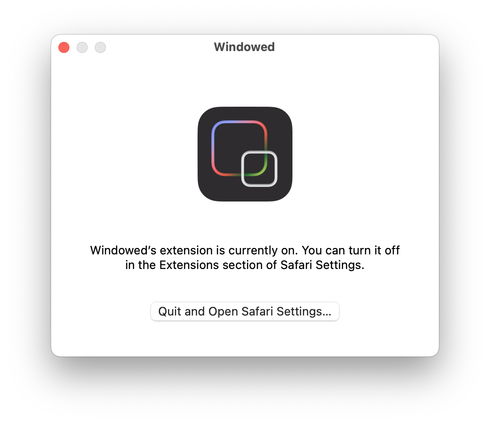

<h3>Windowed - for Apple Safari</h3>

Changes fullscreen buttons to go into a popup. It has the same functionality as the <a href="https://chromewebstore.google.com/detail/windowed-floating-youtube/gibipneadnbflmkebnmcbgjdkngkbklb">Chrome extension</a>.

  

## Installation

- Download the file `Windowed.app.zip` from [latest release](https://github.com/kaiyuyue/Windowed-Safari/releases).
- Unzip the file and drag it to your `Applications` folder.
- **In the Applications folder, right-click** the `Windowed.app` and select `Open`. Then it will pop up the app like this:

  
   

- After that, you can open the app normally.

  
   

## New UI

- **Toolbar Button**

  
   

- **Pop-up** 

  
   

- **In-Window Mode**

  
   

- **Picture-in-Picture Mode**

  
   

## Development

- Clone the repo
- The development project for Xcode is `windowed-safari-app` and open it in Xcode.
- Contributions and PRs are definitely welcome to make it better for Safari

> [!NOTE]
> The released extension is signed with my own Apple Developer ID without any verification from Apple Developer Program. So it won't show up in the Apple Extension Gallery - App Store. It would be great if someone can help me to sign the extension with a verified Apple Developer ID to distribute it in the App Store. Please contact me if you are willing to help. :bowtie:

## Credits

- [Windowed](https://github.com/dralletje/Windowed)
